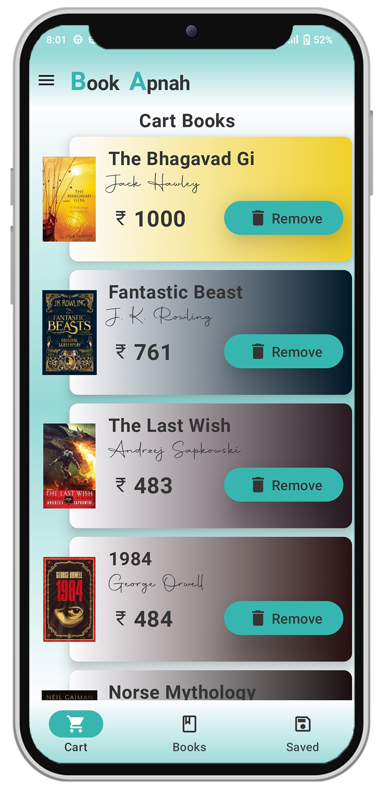
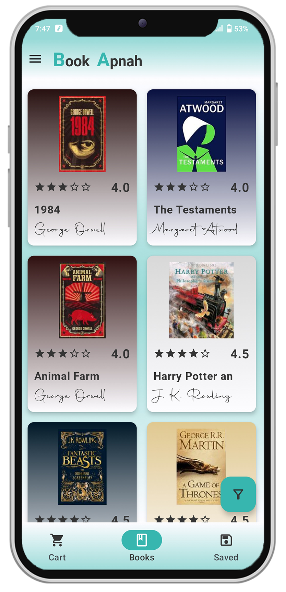
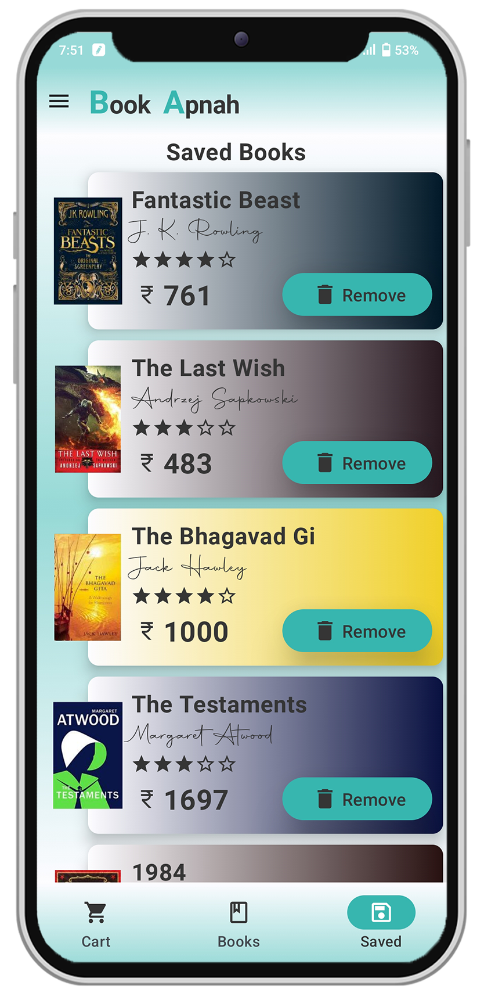
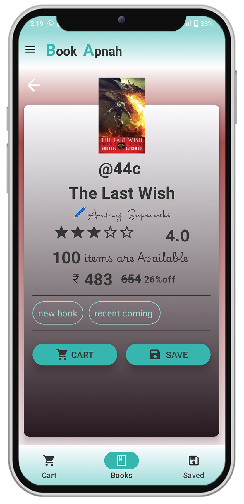
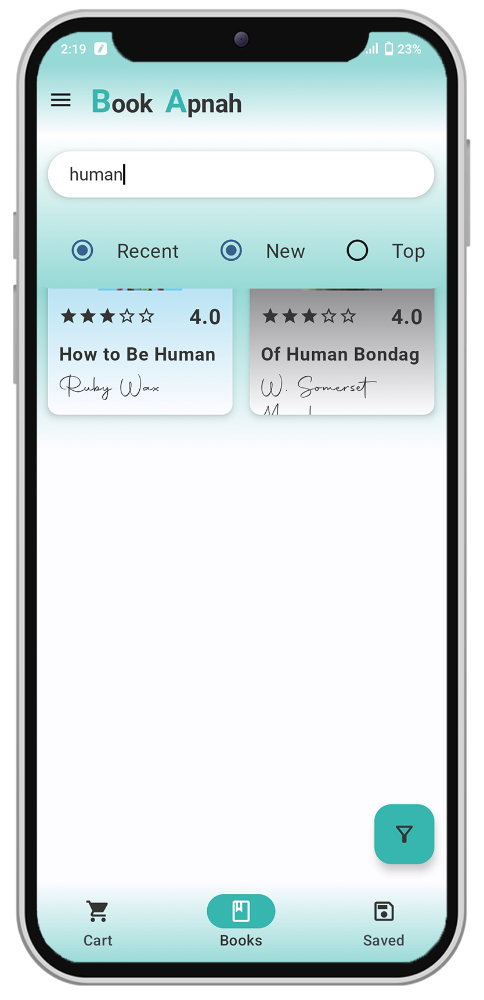
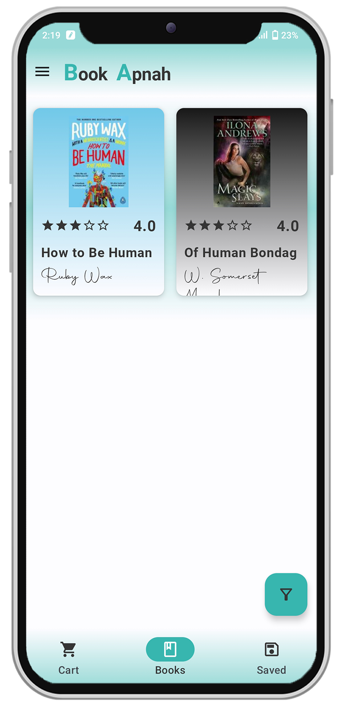
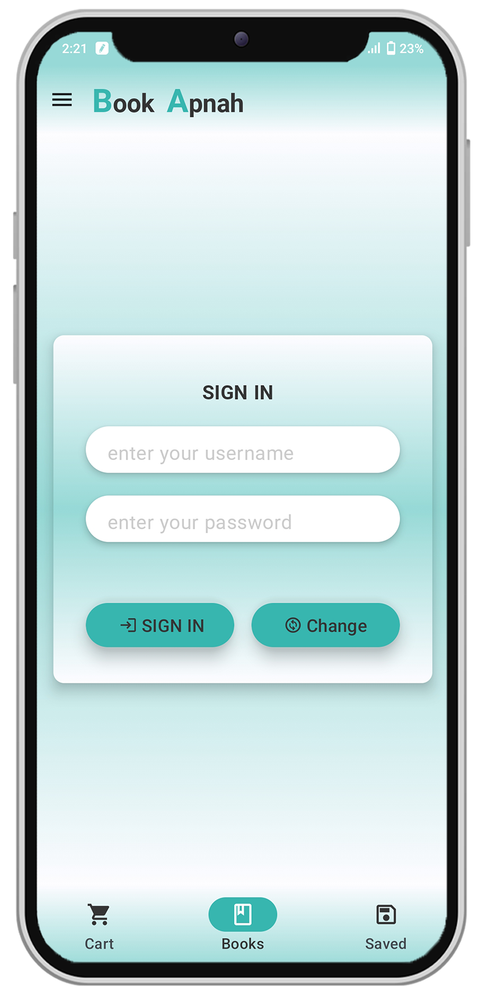
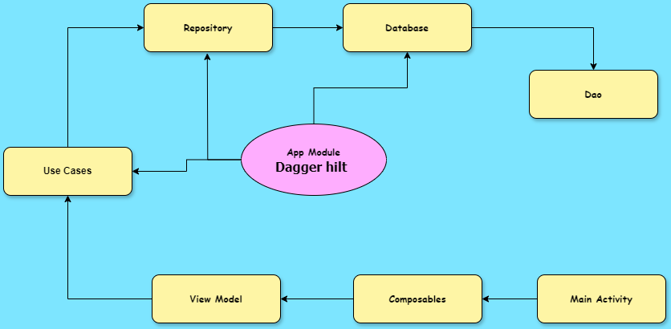

# 📚 Book Apnah - Your Ocean-Themed Online Bookstore 🌊📘 📖 😍

## A Beautiful Book Store App build with Jetpack Compose with 🧹🧼 <B>Clean Architecture</b> ✨ 🧼

## Why Book Apnah 📖✨

Book Apnah is an online bookstore. "Book" means book and "Apnah" (अपनः) in Sanskrit means store.
Discover a wide range of books with an easy-to-use interface. Find your next read with Book Apnah!
📖✨

## Different Screens 📱📲📳

Book Apnah (अपनः) offers an ocean-themed experience with beautifully designed screens. Enjoy a
seamless user interface across features like All Books, Filter Books, Saved Books, cart Books, Sign
In, Sign Up, and more. Dive into a visually pleasing, user-friendly journey to find and purchase
your favorite books! 📖✨

<table style="width:100%">
  <tr>
    <th>
 Cart Books 
 </th>
    <th>
 All Books  
</th>
    <th>
 Saved Books  
</th>
  </tr>
  <tr>
    <td>
 
</td>
    <td>

</td>
    <td>

 </td>
  </tr>
  <tr>
    <th>
 Book Details 
 </th>
    <th>
 Book Filter  
</th>
    <th>
 Filter Result   
</th>
  </tr>
  <tr>
    <td>
 
</td>
    <td>

</td>
    <td>

 </td>
  </tr>
  <tr>
    <th>
Sign In 
 </th>

  </tr>
  <tr>
    <td>
 
</td>

  </tr>
</table>

---

## About 💡🎯

Book Apnah (अपनः) is crafted with clean architecture and the MVVM design pattern, leveraging Jetpack
Compose for a stunning UI. The app is powered by Dagger Hilt for seamless dependency injection and
uses Shared Preferences, Room Database, and Coroutine Flow for efficient data management. Experience
features like All Books, Filter Books, Saved Books, cart Books, Sign In, Sign Up, and more, all
within a beautifully designed, user-friendly interface. Dive into a smooth, enjoyable journey to
discover and purchase your favorite books! 📖✨

---

## video 📺💻

https://github.com/user-attachments/assets/118e9626-3678-414f-beb9-ddd18fa5d2f0
  

---

## Backend 🌍🌐⚠️⛔

- The backend of the app is also developed by myself and it is built with node , express and
  mongodb.
- The backend is not deployed anywhere if anyone wants to test the app he can run the backend
  manually
- I am running the backend in my pc and using localhost I am running the app
- data is already given in my repo in form of csv
- [backend] this is link of backend

## Clean Architecture 🧼🧹

Clean architecture is a software design approach that emphasizes separation of concerns and the
dependency rule,
with the goal of creating maintainable and scalable codebases.
It divides an application into layers, typically including <i>presentation, domain, and data
layers </i>,
each with specific responsibilities and dependencies.
Clean architecture promotes testability, flexibility, and
maintainability by enforcing clear boundaries between components and minimizing coupling between
them.

---

## Separation of Concern 🧐🤭👩

<table style="width:50%">
  <tr>
    <th>
Presentation Layer 
 </th>
    <th>
 Data layer  
</th> 
    <th>
 Domain  
</th> 
  </tr>
  <tr>
    <td>
 User Interface  
</td>
    <td>
 Api Access  
</td>
     <td>
 Connecting Layer  
</td> 
  </tr>
  <tr>
    <td>
 View Model  
</td>
    <td>
 Database Access 
</td>
     <td>
 Business Logic(filter,sort,etc)  
</td> 
  </tr>
  <tr>
    <td>
 Components  
</td>
    <td>
 Database Access 
</td>
     <td>
 Connecting Layer  
</td> 
  </tr>
  <tr>
    <td>
   
</td>
    <td>
 Shared Preferences 
</td>
     <td>
 Model classes , definition to repository  
</td> 
  </tr>
</table>

---

## working 💪⚒

- All the screens are designed completely with jetpack compose
- For injecting the dependencies I am using dagger hilt
- retrofit is used for api access
- Room database is used to store Books
- use cases is for handling the business logic like(filtering , sorting etc )
- flow is used to provide seamlessly fetching of Books

---

## Technologies Used 👩‍💻⚙👨‍💻

- ### [Dagger Hilt ]
    - Dagger Hilt is a dependency injection library for Android development, built on top of Dagger
    - It simplifies the process of dependency injection by providing a set of predefined components
      and annotations, reducing boilerplate code and improving readability. Dagger Hilt integrates
      seamlessly with Jetpack libraries and Android's lifecycle, making it the preferred choice for
      managing dependencies in modern Android apps
- ### [Clean Architecture]
    - Clean architecture is a software design approach that emphasizes separation of concerns and
      the dependency rule, with the goal of creating maintainable and scalable codebases. It divides
      an application into layers, typically including presentation, domain, and data layers, each
      with specific responsibilities and dependencies. Clean architecture promotes testability,
      flexibility, and maintainability by enforcing clear boundaries between components and
      minimizing coupling between them.
- ### [mvvm ]

    - MVVM stands for Model-View-ViewModel, which is a software architectural pattern commonly used
      in modern UI frameworks, including Android development. In MVVM, the application is divided
      into three main components:

        1. Model: Represents the data and business logic of the application.
        2. View: Represents the UI components visible to the user.
        3. ViewModel: Acts as an intermediary between the View and the Model, providing data and
           behavior to the View while
        4. abstracting away the underlying business logic.

    - MVVM promotes separation of concerns, making it easier to maintain and test the codebase. It
      also facilitates reusability of components and promotes a more modular architecture.

- ### [jetpack compose]
    - Jetpack Compose is a modern toolkit for building native Android UIs using a declarative
      approach. It allows developers to create UI components using Kotlin code, with a focus on
      simplicity, productivity, and performance. With Jetpack Compose, UIs are defined as functions
      that describe what should be displayed based on the current state of the app. This declarative
      style simplifies UI development, reduces boilerplate code, and enables powerful features like
      state management, animations, and theming. Jetpack Compose is part of the Android Jetpack
      library and is designed to work seamlessly with existing Android APIs and frameworks.
- ### [ Retrofit ]
    - Retrofit is a concise and powerful HTTP client library for Android and Java applications. It
      simplifies the process of making network requests by providing a high-level API with
      annotations for URL handling and parameter passing. Retrofit supports asynchronous
      programming, error handling, and seamless integration with popular libraries like RxJava for
      reactive programming.

---

[mvvm]: https://www.geeksforgeeks.org/mvvm-model-view-viewmodel-architecture-pattern-in-android/

[Clean Architecture]: https://betterprogramming.pub/the-clean-architecture-beginners-guide-e4b7058c1165#:~:text=The%20Clean%20Architecture%20is%20the,over%20the%20years.

[Dagger Hilt ]: https://developer.android.com/training/dependency-injection/hilt-android

[jetpack compose ]: https://developer.android.com/develop/ui/compose/documentation

[Retrofit ]: https://github.com/square/retrofit

[backend ]: https://github.com/Vibhav00/BookApnahBackend
